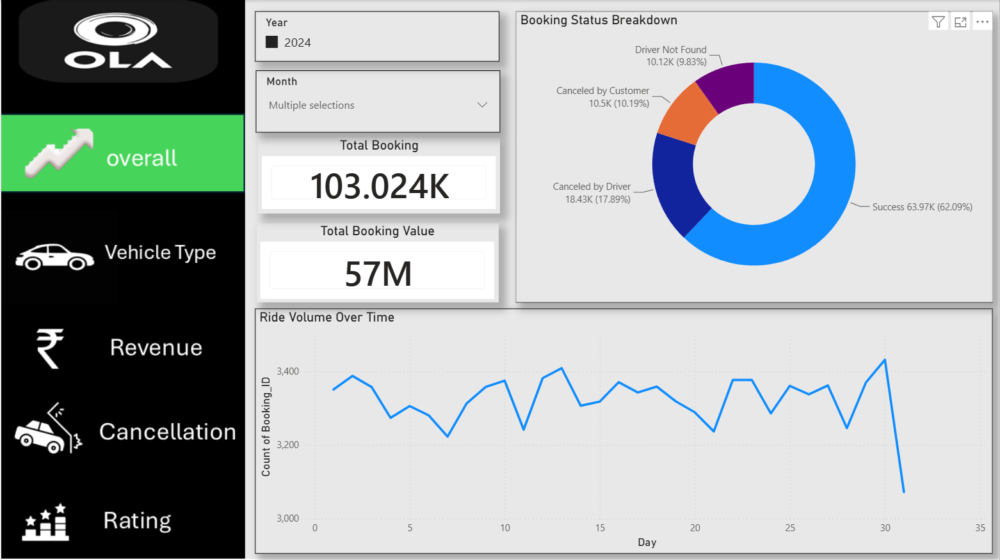
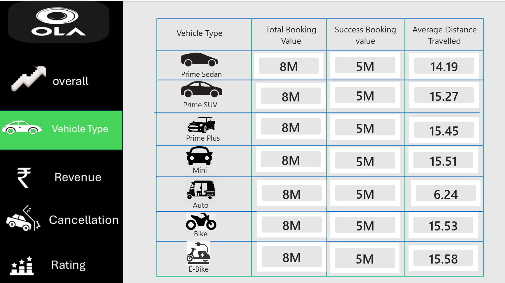
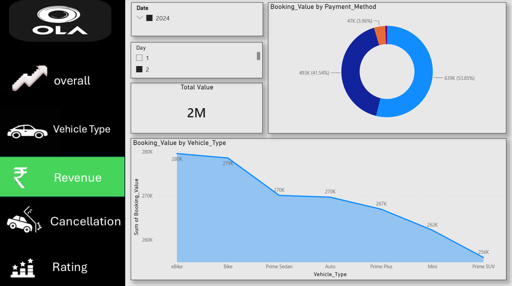
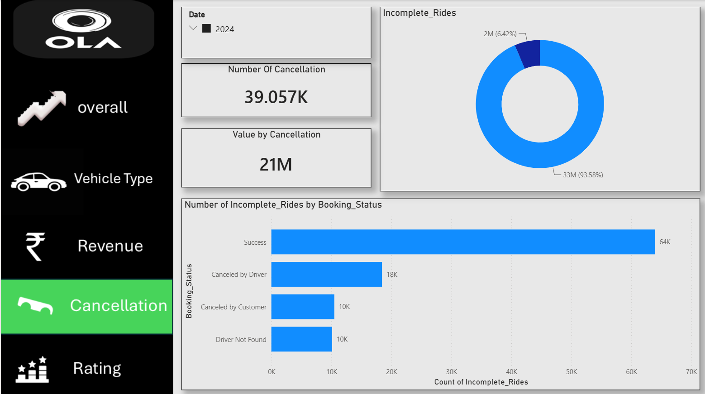
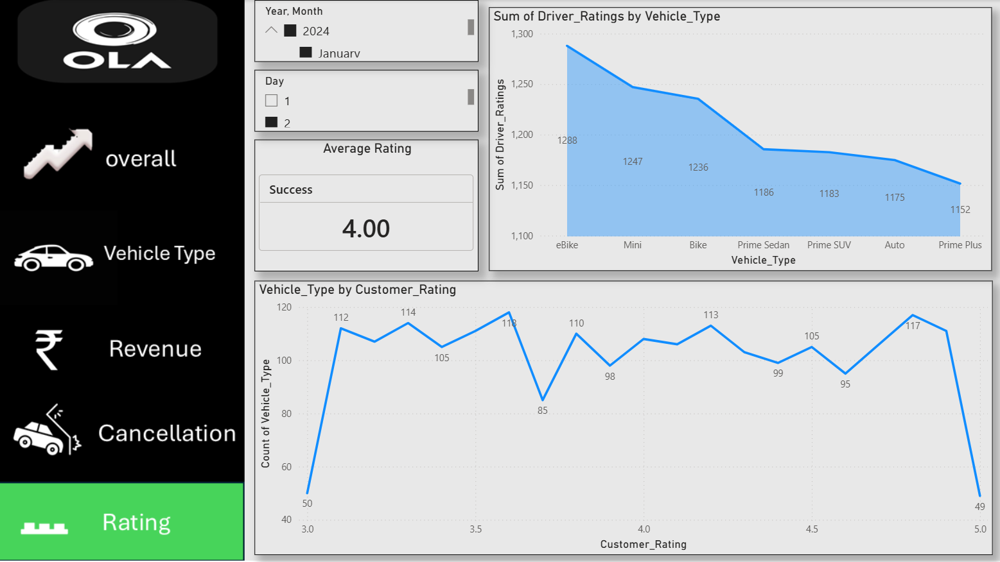

# OLA Ride Booking Analysis - Power BI

## 📊 Project Overview

This project analyzes OLA ride-booking data using Microsoft Power BI.

The dashboard provides a detailed view of booking performance, revenue,
cancellations, vehicle types, ratings, payment methods, and ride trends.

The objective of this project is to identify important business insights
from ride-booking data and present them through an interactive Power BI
dashboard.

---

## 🛠️ Tools & Technologies

- Microsoft Power BI
- Power Query
- DAX
- Excel / CSV
- Data Visualization
- Data Analysis

---

## 📌 Dashboard Pages

### 1. Overall Analysis

The Overall dashboard provides a high-level view of:

- Total Bookings
- Total Booking Value
- Booking Status Breakdown
- Ride Volume Over Time
- Successful and Cancelled Bookings

---

### 2. Vehicle Type Analysis

This page analyzes performance across different vehicle types.

Vehicle types include:

- Prime Sedan
- Prime SUV
- Prime Plus
- Mini
- Auto
- Bike
- E-Bike

The dashboard compares:

- Total Booking Value
- Successful Booking Value
- Average Distance Travelled

---

### 3. Revenue Analysis

The Revenue dashboard analyzes booking value by:

- Payment Method
- Vehicle Type
- Total Booking Value

---

### 4. Cancellation Analysis

The Cancellation dashboard analyzes incomplete rides and cancellation patterns.

It includes:

- Number of Cancellations
- Cancellation Value
- Incomplete Rides
- Booking Status
- Cancelled by Driver
- Cancelled by Customer
- Driver Not Found

---

### 5. Rating Analysis

The Rating dashboard analyzes:

- Average Rating
- Driver Ratings
- Customer Ratings
- Vehicle Type
- Rating distribution

---

## 📈 Key Insights

Some important observations from the dashboard include:

- Successful bookings represent the largest share of total bookings.
- Driver cancellations and customer cancellations contribute significantly
  to incomplete rides.
- Different vehicle categories show different booking-value and distance
  patterns.
- Payment methods contribute differently to total booking value.
- Driver and customer ratings can be analyzed to understand service quality.
- Ride volume changes across different days and time periods.

---

## 📂 Project Structure

``text
ola-ride-booking-analysis-powerbi/
│
├── README.md
├── PowerBI/
│   └── OLA_Ride_Booking_Analysis.pbix
├── Dataset/
│   └── ola_ride_booking_data.csv
├── Screenshots/
│   ├── overall.png
│   ├── vehicle.png
│   ├── revenue.png
│   ├── cancellation.png
│   └── rating.png
└── Documentation/
    └── project_notes.md
🎯 Business Objectives

The project aims to answer questions such as:

What is the total number of bookings?
What is the total booking value?
What percentage of bookings are successful?
Which vehicle types generate higher booking value?
What are the major reasons for incomplete rides?
How many rides are cancelled by drivers?
How many rides are cancelled by customers?
Which payment methods contribute the most booking value?
How does ride volume change over time?
What is the average distance travelled for different vehicle types?
💡 Skills Demonstrated
Data Cleaning
Data Transformation
Data Modeling
DAX
KPI Development
Power BI Dashboard Design
Data Visualization
Business Analysis
Interactive Filtering
Storytelling with Data
📷 Dashboard Preview
Overall

Vehicle Type

Revenue

Cancellation

Rating

👤 Author

Krish Shelokar

Data Analytics | Power BI | SQL | Exel
